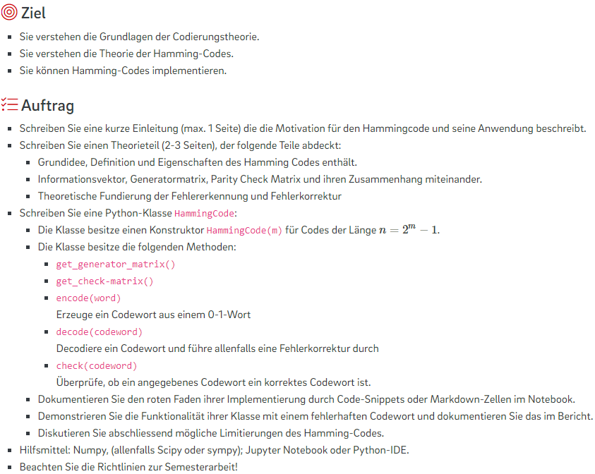

# FFHS
## Codierungstheorie
### LinAlg, Lineare Algebra, INF-P-MS007, BE-Sa-1, HS22/23, Prof. Dr. Dehmer Matthias


```bash
~~~~~~~~~~~~~~~~ (7, 4)-Hamming-Code ~~~~~~~~~~~~~~~~
Please enter new codeword or x for exit:
> 1100
Encoded: 1100011
Manipulate one bitflip: 1000011
Filured Codeword: 1000011
Position of failure: 2
Bit-flipped codeword: 1000011
Corrected codeword: 1100011
Decoded: 1100
```